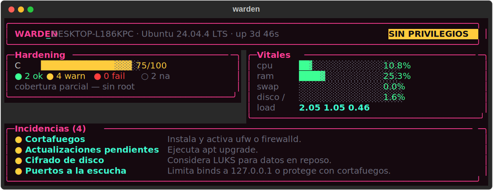
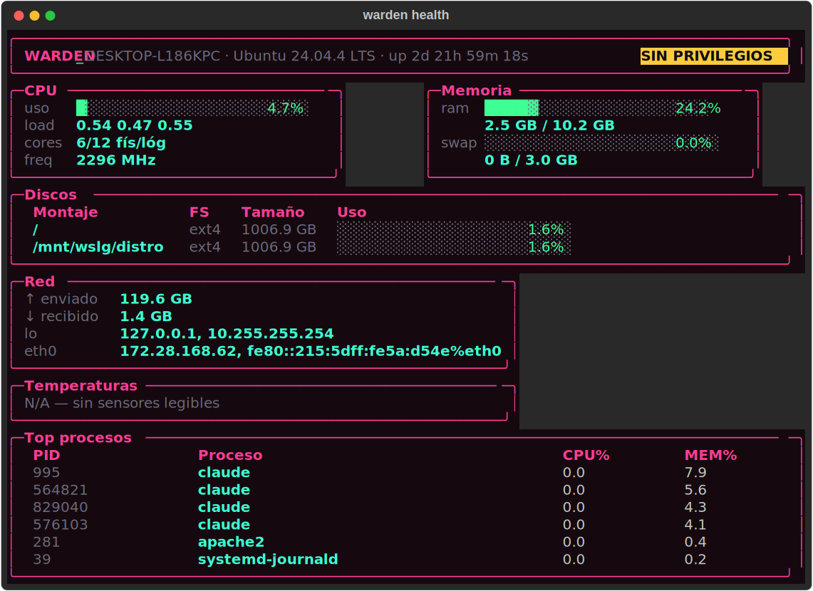
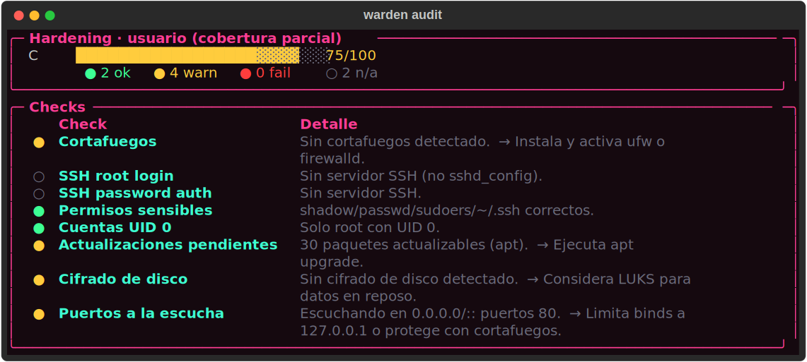

<div align="center">

# `WARDEN_`

**Auditor de host y panel de sistemas para la terminal.**
Diagnóstico en vivo · auditoría de seguridad · todo desde la línea de comandos.


`>IZ::` · Israel Zamora Tejero · *Glitchbane*

</div>

---

<div align="center">



<details>
<summary><b>Más capturas</b> — <code>warden health</code> · <code>warden audit</code></summary>





</details>

</div>

## Qué es

`WARDEN_` es la herramienta de cabecera del técnico de sistemas: un solo comando
que te dice **cómo está la máquina** (CPU, RAM, discos, red, temperaturas,
procesos) y **cómo de segura es** (auditoría de hardening del host local).

Pensado para vivir en la terminal: cada función es un subcomando *scriptable* y
*cron-able*, con salida visual (`rich`) para humanos y `--json` estable para
máquinas y CI. El núcleo de lógica es independiente del front-end — datos
estructurados que se pintan después.

Cubre el **host local**. Para la red, su pareja es `LuaNetSentinel`.

## Instalación

```bash
pipx install git+<url-del-repo>     # aislado, por-usuario
# o, para desarrollo:
git clone <url-del-repo> && cd warden
python -m venv .venv && . .venv/bin/activate
pip install -e .
```

Requiere **Python 3.11+**. Linux primero (macOS/Windows degradan a `N/A`, no revientan).

## Uso

```bash
warden                      # dashboard: hardening score + vitales + incidencias
warden health              # diagnóstico completo (CPU/RAM/discos/red/temps/procesos)
warden health --watch      # refresco en vivo cada 2 s (Ctrl-C para salir)
warden health --json       # salida JSON versionada (para CI / automatización)
warden health --md         # salida Markdown (para tu vault / informes)
warden info                # información del SO / sistema

warden audit               # auditoría de seguridad + hardening score 0-100
warden audit --json        # salida JSON versionada (para CI)
warden audit --md          # salida Markdown
warden audit --fail-on fail # en CI: solo los FAIL devuelven código !=0
warden audit --lynis       # fuerza un run fresco de Lynis (lento, mejor con root)

warden report              # informe combinado health + audit (= dashboard)
warden report --json       # un único JSON versionado con health + audit
warden report --md         # informe Markdown completo para tu vault
```

Los comandos respetan **códigos de salida** (`0` ok · `1` warn · `2` fail), así
que `warden audit --fail-on warn` es usable directamente en un pipeline de CI.

## Características

| | Estado |
|---|---|
| Diagnóstico en vivo (CPU/RAM/swap/discos/red/temps/procesos) | ✅ |
| Dashboard con tema *Glitchbane* (`rich`) | ✅ |
| Salida `--json` versionada (`schema_version`) + `--md` | ✅ |
| Detección de privilegios (root) | ✅ |
| Degradación a `N/A` cuando un dato no es legible (nunca *traceback*) | ✅ |
| Auditoría de seguridad (checks propios + wrapper de Lynis) | ✅ |
| Hardening score `0-100` + grade `A-F` | ✅ |
| Códigos de salida `0/1/2` + `--fail-on` para CI | ✅ |
| Dashboard de resumen (`warden` sin args): score + vitales + incidencias | ✅ |
| Informe combinado health + audit (`report`, JSON/Markdown versionado) | ✅ |
| OSINT: self-exposure (IP pública, geoloc, puertos expuestos) | 🔜 fase 3 |
| Secret leak scan (env, history, ficheros world-readable) | 🔜 fase 3 |
| Generación de scripts (backup / cleanup / update) | 🔜 fase 3 |

## Arquitectura

```
warden/
  cli.py               # typer: subcomandos
  console.py           # Console rich + tema Glitchbane
  platform_utils.py    # SO + privilegios
  core/                # ← solo datos, sin rich/typer (testeable)
    system.py          #   collectors psutil -> dataclasses
    security.py        #   checks propios + Lynis -> CheckResult + score
    report.py          #   combina health + audit -> dataclass + JSON
  render.py            # render rich de los datos
```

**Regla de oro:** `core/` devuelve datos estructurados sin saber nada de
`rich`/`typer`. Testeable de forma aislada y deja la puerta abierta a una TUI
encima sin tocar la lógica.

## Desarrollo

```bash
pip install -e .
python tests/test_warden.py     # self-check (o: pytest)
```

## Stack

`python>=3.11` · `psutil` · `rich` · `typer` · `distro`

## Roadmap

- **Fase 0** — diagnóstico (`health`/`info`), tema, privilegios. ✅
- **Fase 1** — `audit`: checks propios + wrapper de Lynis + hardening score. ✅
- **Fase 2** — `report` combinado (JSON/MD) + dashboard de resumen. ✅
- **Fase 3** — `script` (generación) + OSINT (`expose`, leak scan).
- **Fase 4** — 2.º SO, ejecución/programación de scripts, histórico, CVE (OSV), binario `pyinstaller`, TUI.

---

<div align="center">

`>IZ::` · Israel Zamora Tejero · *Glitchbane* · MIT

</div>
