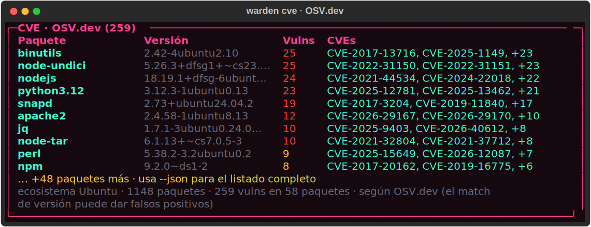
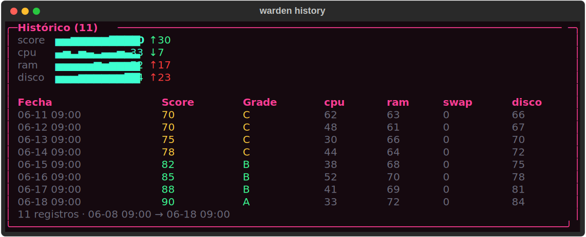
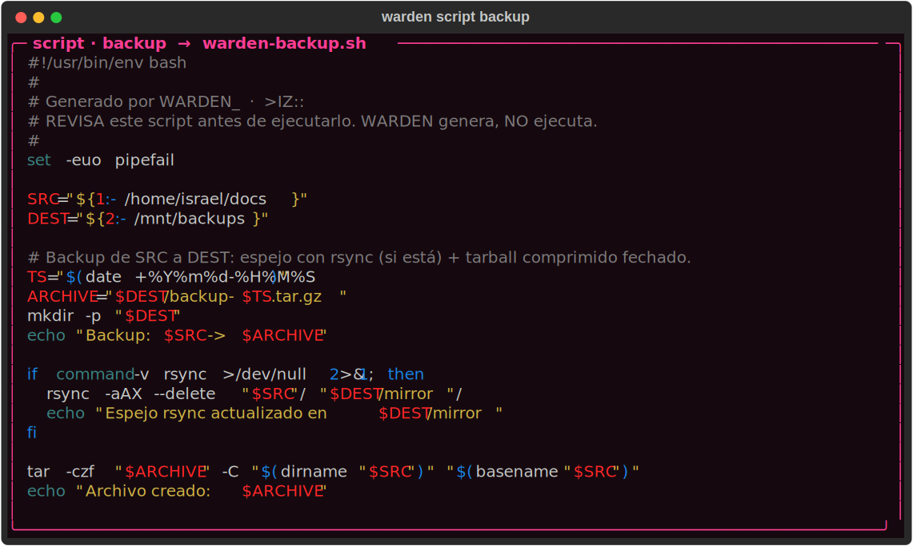

<div align="center">

# `WARDEN_`

**Auditoría de seguridad y diagnóstico de host, todo en la terminal.**
Hardening score · CVEs de tus paquetes · OSINT de exposición · salida lista para CI.


`>IZ::` · Israel Zamora Tejero · *Glitchbane*

</div>

---

<div align="center">


<details>
<summary><b>Más capturas</b> — <code>health</code> · <code>audit</code> · <code>cve</code> · <code>history</code> · <code>script</code></summary>








</details>

</div>

## Por qué

Revisar el estado y la seguridad de una máquina Linux significa saltar entre
`htop`, `df`, `ss`, `lynis`, grepear configs de SSH y buscar CVEs de paquetes a
mano. `WARDEN_` reúne todo eso en **un solo comando**: salida visual para
humanos y `--json` estable para máquinas, con **códigos de salida pensados para
CI/cron**. Herramienta de cabecera para técnico de sistemas, pensada para vivir
en la terminal.

Linux primero. Cubre el **host local**; para la red, su pareja es `LuaNetSentinel`.

## Qué responde, de un vistazo

| Pregunta | Comando |
|---|---|
| ¿Cómo está la máquina **ahora**? | `warden` · `warden health` |
| ¿Cómo de **endurecida** está? | `warden audit` → score `0-100` + grade `A-F` |
| ¿Tengo paquetes con **CVE conocida**? | `warden cve` (vía OSV.dev) |
| ¿Qué **expongo** a internet? | `warden expose` (IP, geoloc, puertos públicos) |
| ¿Hay **secretos filtrados** en el sistema? | `warden scan-secrets` |
| ¿Estoy **mejorando o empeorando** con el tiempo? | `warden history` (tendencias) |

## Capacidades

**Diagnóstico** — CPU (global/por-core/load), RAM + swap, discos, red,
temperaturas y top de procesos vía `psutil`. Modo `--watch` en vivo. Dato no
legible → `N/A`, nunca *traceback*.

**Seguridad** — auditoría de hardening con **checks propios** (firewall, SSH,
permisos sensibles, UID 0, actualizaciones, cifrado de disco, puertos a la
escucha) **+ wrapper de Lynis**, condensada en un **hardening score 0-100 + grade
A-F**. CVEs de paquetes instalados vía **OSV.dev**, OSINT de **auto-exposición** y
**secret-leak scan** (env, history, ficheros legibles por otros).

**Automatización** — todo subcomando es *scriptable* y *cron-able*, con `--json`
**versionado** (`schema_version`) y **códigos de salida `0/1/2`** + `--fail-on`
para usar `audit` como gate de CI. Histórico append-only con sparklines de
tendencia. Generación de scripts (backup/cleanup/update) que **WARDEN no
ejecuta**: tú revisas y corres.

## En CI y cron

```bash
# Gate de seguridad en CI: rompe el build solo si hay un FAIL
warden audit --fail-on fail

# Snapshot diario para tendencias (crontab -e)
0 9 * * *   warden record

# Inventario de CVEs a JSON para tu pipeline
warden cve --json > cves.json
```

Códigos de salida: `0` todo OK · `1` hubo WARN · `2` hubo FAIL. `--fail-on`
decide el umbral.

## Instalación

```bash
pipx install git+https://github.com/isradev-git/warden.git   # aislado, por-usuario
# o, para desarrollo:
git clone https://github.com/isradev-git/warden.git && cd warden
python -m venv .venv && . .venv/bin/activate
pip install -e .
```

Requiere **Python 3.11+**. Linux primero (macOS/Windows degradan a `N/A`, no revientan).

## Uso

```bash
warden                       # dashboard: hardening score + vitales + incidencias
warden health [--watch]      # diagnóstico (CPU/RAM/discos/red/temps/procesos)
warden audit  [--fail-on …]  # auditoría de seguridad + hardening score 0-100
warden cve    [--details N]  # CVEs de paquetes instalados (OSV.dev)
warden expose                # OSINT: IP pública, geoloc, reverse DNS, puertos públicos
warden scan-secrets          # secretos en env, history y ficheros sensibles
warden record / history      # snapshot + tendencias (sparklines de score y vitales)
warden script <backup|cleanup|update> [--src --dest] [-o FILE]   # genera, NO ejecuta
warden report                # informe combinado health + audit
warden info                  # información del SO / sistema
```

Casi todos aceptan `--json` (máquina/CI) y `--md` (vault/informes), ambos versionados.

## Arquitectura

```
warden/
  cli.py               # typer: subcomandos (front-end fino)
  console.py           # Console rich + tema Glitchbane
  platform_utils.py    # SO + privilegios
  core/                # ← solo datos, sin rich/typer (testeable de forma aislada)
    system.py    security.py    report.py    cve.py
    expose.py    secrets.py     scripts.py   history.py
  render.py            # toda la presentación rich vive aquí
```

**Regla de oro:** `core/` devuelve dataclasses sin saber nada de `rich`/`typer`.
La presentación se aísla en `render.py` y el CLI es una capa fina. Resultado:
lógica testeable y salida (terminal / JSON / Markdown) intercambiable.

## Decisiones de diseño

- **Degrada, no revienta** — sin permiso/sensor/herramienta → `N/A`, nunca un *traceback*.
- **Envuelve Lynis** en vez de reinventar la auditoría; checks propios solo para lo barato y portable.
- **CVEs vía OSV.dev** (consulta batch) — sin base de datos local que mantener.
- **JSON versionado** (`schema_version`) para no romper integraciones al evolucionar.
- **Genera scripts, no los ejecuta** — el riesgo de tocar el sistema queda en manos del usuario.
- **Privilegios siempre explícitos** — si no es root, la salida dice qué cobertura es parcial.

## Desarrollo

```bash
pip install -e .
python tests/test_warden.py     # self-check (o: pytest)
```

## Stack

`python>=3.11` · `psutil` · `rich` · `typer` · `distro` · OSINT/CVE vía `urllib` (stdlib)

Por diseño, `WARDEN_` es **solo terminal + `rich`**: sin binario, sin TUI, Linux primero.

---

<div align="center">

`>IZ::` · Israel Zamora Tejero · *Glitchbane* · MIT

</div>
